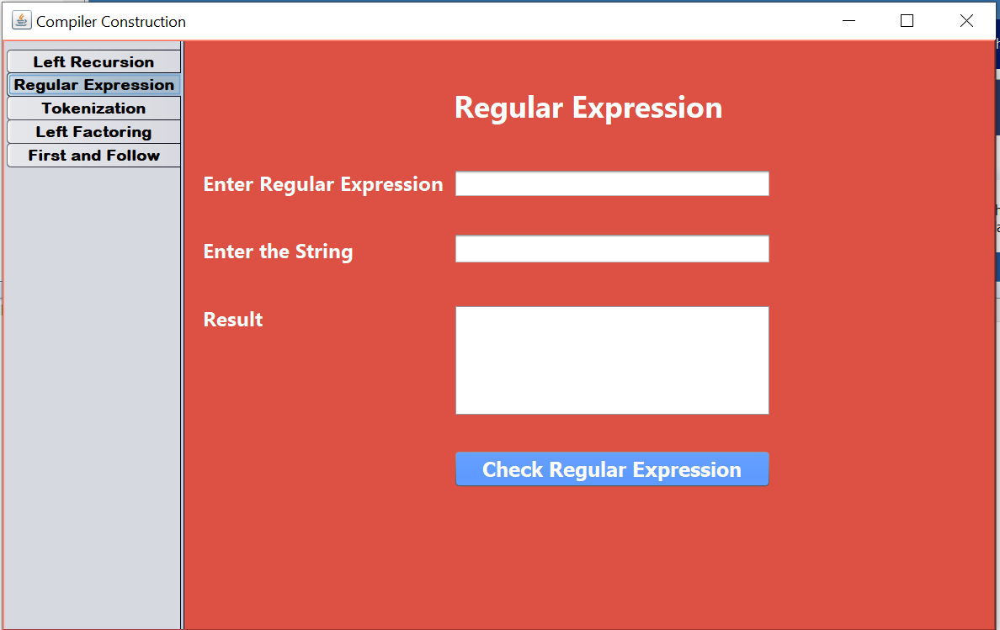
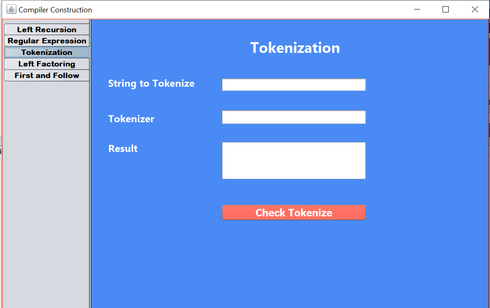

# Compiler Construction
Compiler construction work related ton regular expression, tokenization, left recursion and factoring.
Project is developed on java language.

<a href="https://github.com/Zaryab-Programmer/Compiler-Construction/tree/master/Documents/NetBeansProjects/Compiler_Construction">View Code</a>

## Topics Covered in Project
- Regular Experssion 
- Tokenization
- left Recursion 
- Left Factoring
- First and Follow

## Tools
- Netbeans IDE

## Regular Experssion

## Tokenization

## Regular Experssion

## Regular Experssion

